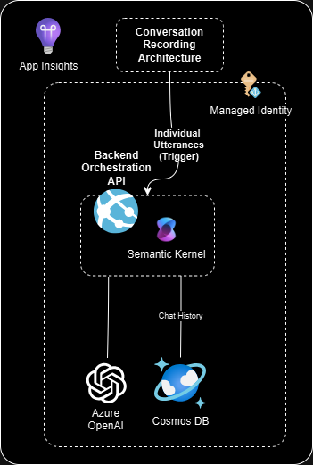
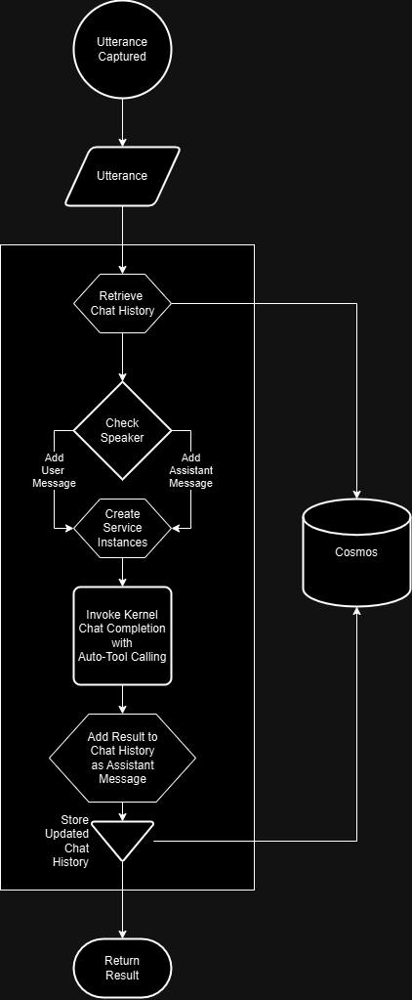

# Passive Transcript Gen AI RAG Search

This is an example python application that demonstrates the use of Semantic Kernel to search knowledge sources using plugins as triggered off of new utterances in an ongoing conversation between a customer and a call center advocate.

A key challenge taken on by this project is that LLM models are currently trained with the context of the chat conversation taking place between the LLM and a single user. In this scenario however, the conversation is taking place between a customer and a call center advocate with the LLM representing a third participant in the conversation. From a "chat" perspective, the LLM plays an active role however in the context of a greater architecture, the AI can be relegated to more of a _passive_ participant, silently offering insight to the advocate. To avoid confusing the LLM, advocate messages are aligned with the LLM as both being assistant messages as both the LLM and advocate are also aligned in motivation - assisting the user. This project chose not to make any distinction between the two at the persistence layer for chat history to simplify scope of the project.

## Features
- Flask App
    - Receives new utterances from a webhook endpoint
    - Builds a chat history from utterances and RAG completions
    - Identifies customer questions and seeks answers from knowledge sources encapsulated as RAG plugins

## Application Architecture



- **Flask App**: The application is a simple Flask app designed to receive utterances at a webhook endpoint as driven by events containing new utterances coming off of an event hub. These events could be intercepted and conditionally acted on by an Azure Function before being pushed to the webhook. The application leverages Semantic Kernel to orchestrate calls to Open AI
	- [Semantic Kernel](https://learn.microsoft.com/en-us/semantic-kernel/overview) - builds and orchestrates the agents, RAG pattern completion between the services, and API actions while managing chat history and other capabilities. Framework easily extended with additional plugin functions easy (more data sources, logic, actions, etc.).
	- [Azure OpenAI Service](https://learn.microsoft.com/azure/search/search-what-is-azure-search) - provides the Large Language Models to generate responses and for vectorization when needed.

The architecture for the recording and eventing of utterances is left open ended for this project. And the output assistant messages with aggregated peritent knowledge to assist with the call can either be consumed directly from the endpoint or extracted from the database through a separate process.

### Logical Flow


This application is designed to receive utterance events with payloads resembling:
```
{
	"callAgent": "jsmith",
	"callId": "27862357-9601-43f0-9ce5-98fb752e2a62",
	"role": "USER",
	"utterance": "Hi, this is John Q Public."
}
```
- callAgent: the user ID of the call center advocate taking the customer call.
- callId: a GUID for the given phone call.
- role: enum of either "USER" or "ASSISTANT" where casing does not matter. User represents the customer calling; assistant represents the call center advocate.
- utterance: string of words being said/uttered.

Once a payload is received, the application creates an instance of a Cosmos Service authenticated (using managed identity by default but optionally can use key-based authentication). The service retrieves any existing [ChatHistory](https://learn.microsoft.com/en-us/python/api/semantic-kernel/semantic_kernel.contents.chat_history.chathistory?view=semantic-kernel-python) using the callAgent as the partition key and the callId as the item id.

If the incoming utterance has a user role then it is added to the ChatHistory object as a user message, otherwise if it has an assistant role then it is added to the ChatHistory pbkect as a user message. Any other role values are rejected with a 400 response.

Once chat history is defined, the application instantiates other required services for plugins being added to the [Kernel](https://learn.microsoft.com/en-us/python/api/semantic-kernel/semantic_kernel.kernel(class)?view=semantic-kernel-python) and finally creates the KernelService.

Then the Kernel is invoked to perform a chat completion with auto-tool calling enabled so that when the underlying LLM (Azure Open AI) predicts that a tool is appropriate given the context of its system message and the chat history the application has managed, it will invoke the appropriate function inside the plugins that have been added to the kernel.

The resulting chat completion is added to the ChatHistory object. Note that while the application must manually add the resulting completion back to the ChatHistory object, the acting of creating the completion already added any intermediate tool invocations to the ChatHistory object.

Finally the ChatHistory object is persisted to Cosmos and the final completion result is returned to the caller for use.

# Getting Started

## Account Requirements

In order to deploy and run this example, you'll need

- **Azure Account** - If you're new to Azure, get an [Azure account for free](https://aka.ms/free) and you'll get some free Azure credits to get started.
- **Azure subscription with access enabled for the Azure OpenAI service** - [You can request access](https://aka.ms/oaiapply). You can also visit [the Cognitive Search docs](https://azure.microsoft.com/free/cognitive-search/) to get some free Azure credits to get you started.
- **Azure account permissions** - Your Azure Account must have `Microsoft.Authorization/roleAssignments/write` permissions, such as [User Access Administrator](https://learn.microsoft.com/azure/role-based-access-control/built-in-roles#user-access-administrator) or [Owner](https://learn.microsoft.com/azure/role-based-access-control/built-in-roles#owner).


## Cost estimation
Pricing varies per region and usage, so it isn't possible to predict exact costs for your usage. However, you can try the [Azure pricing calculator](https://azure.microsoft.com/pricing/calculator/) for the resources below:

- [**Azure App Service**](https://azure.microsoft.com/en-us/pricing/details/app-service/linux/)
- [**Azure OpenAI Service**](https://azure.microsoft.com/pricing/details/cognitive-services/openai-service/)
- [**Azure Cosmos DB**](https://azure.microsoft.com/en-us/pricing/details/cosmos-db/)
- [**Azure Monitor**](https://azure.microsoft.com/pricing/details/monitor/)

## Deployment
This project supports `azd` for easy deployment of the complete application, as defined in the main.bicep resources.  

If you choose not use `azd` then you can see [here](https://learn.microsoft.com/en-us/azure/app-service/quickstart-python?tabs=flask%2Cwindows%2Cazure-cli%2Cazure-cli-deploy%2Cdeploy-instructions-azportal%2Cterminal-bash%2Cdeploy-instructions-zip-azcli) for instructions on deploying a flask app to an Azure App Service.

## Running locally for Dev and Debug

As many cloud resources are required to run the client app and minimal API even locally, deployment to Azure first will provision all the necessary services. You can then configure your local user secrets to point to those required cloud resources before building and running locally for the purposes of debugging and development.

If you've run `azd up`, all of the secrets are in your .azure/{env name}/.env file. You can copy the full file into your /src folder and then you're ready to debug. If you're avoiding `azd`. You must create the prerequisite services and copy the relevant secrets into an .env file in the /src folder. You can find an example .env in the /src folder for guidance.

Important to note if you are adding the AZURE_OPENAI_BASE_URL value, the value you copy from the Azure portal might be missing a critical /openai/ segment at the end of the url. If it is missing, you must add that segment to the end of your secret in the .env file.

For authenticating to Azure resources, the code supports either managed identity or key based auth. For key based auth you must include the keys in the .env file. For managed identity, it relies on [DefaultAzureCredential](https://learn.microsoft.com/en-us/python/api/azure-identity/azure.identity.defaultazurecredential?view=azure-python). If you've run `azd up`, the bicep templates will grant you the necessary permissions. Otherwise, you will need the [Azure AI Developer](https://learn.microsoft.com/en-us/azure/ai-studio/concepts/rbac-ai-studio#azure-ai-developer-role) on either the resource group or the Azure Open AI resource. In addition you will need read/write permissions for Cosmos DB, [here](https://learn.microsoft.com/en-us/azure/cosmos-db/nosql/security/how-to-grant-data-plane-role-based-access?tabs=built-in-definition%2Ccsharp&pivots=azure-interface-cli) is a way to grant those permissions to a user.

**Required cloud resources:**
- Azure App Service
- Azure OpenAI Service
	- chat model
- CosmosDB

## Contributing

This project welcomes contributions and suggestions.  Most contributions require you to agree to a
Contributor License Agreement (CLA) declaring that you have the right to, and actually do, grant us
the rights to use your contribution. For details, visit https://cla.opensource.microsoft.com.

When you submit a pull request, a CLA bot will automatically determine whether you need to provide
a CLA and decorate the PR appropriately (e.g., status check, comment). Simply follow the instructions
provided by the bot. You will only need to do this once across all repos using our CLA.

This project has adopted the [Microsoft Open Source Code of Conduct](https://opensource.microsoft.com/codeofconduct/).
For more information see the [Code of Conduct FAQ](https://opensource.microsoft.com/codeofconduct/faq/) or
contact [opencode@microsoft.com](mailto:opencode@microsoft.com) with any additional questions or comments.

## Trademarks

This project may contain trademarks or logos for projects, products, or services. Authorized use of Microsoft 
trademarks or logos is subject to and must follow 
[Microsoft's Trademark & Brand Guidelines](https://www.microsoft.com/en-us/legal/intellectualproperty/trademarks/usage/general).
Use of Microsoft trademarks or logos in modified versions of this project must not cause confusion or imply Microsoft sponsorship.
Any use of third-party trademarks or logos are subject to those third-party's policies.
